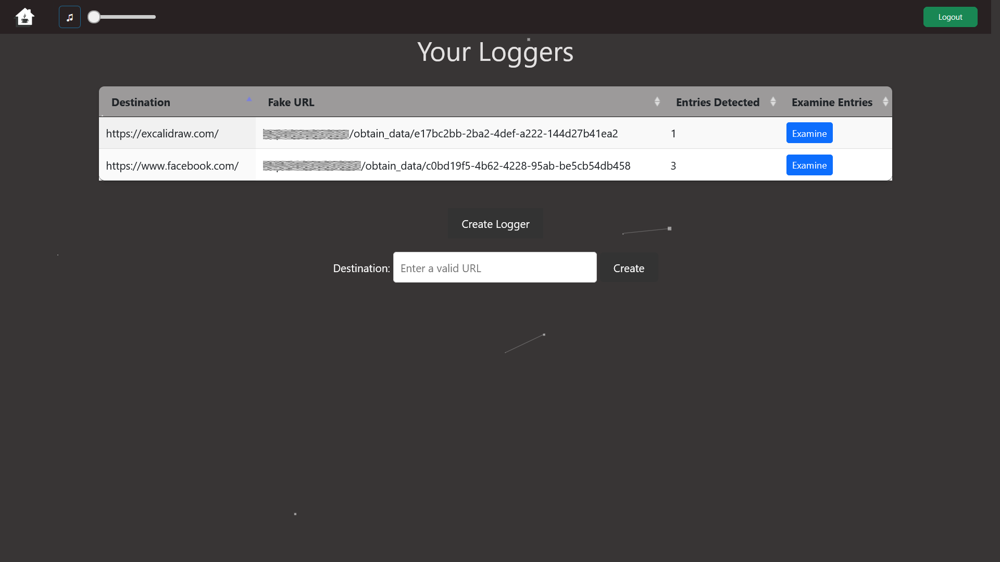
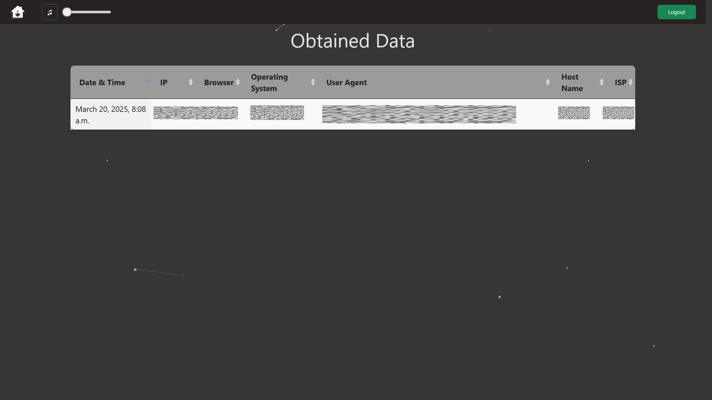

# OSINT-Global-Offensive

## Introduction

OSINT-Global-Offensive is an advanced open-source intelligence (OSINT) framework designed to streamline and automate the
process of gathering, analyzing, and processing publicly available information. Built for cybersecurity professionals,
ethical hackers, and investigative researchers, this project leverages various data sources to provide actionable
intelligence.

## Key Features

- **Automated Data Collection** – Extract and process data from multiple sources, including social media, websites, and
  public databases.
- **Modular Architecture** – Easily extend functionality with new data sources and processing modules.
- **Efficient Search & Filtering** – Query and filter results to extract relevant insights.
- **Data Normalization** – Standardizes extracted data for better analysis and correlation.
- **Extensive API Support** – Integrates with third-party services and APIs for enriched intelligence gathering.
- **Scalability** – Built with Docker to ensure easy deployment and scalability.
- **Enhanced Security** – Leverages HashiCorp Vault for secure storage of secrets and credentials.
- **Custom Git Modules** – Implements `not_gitmodules` to manage dependencies more effectively.

## Use Cases

- **Cybersecurity Investigations** – Identify threats, track malicious actors, and uncover security vulnerabilities.
- **Threat Intelligence** – Monitor potential risks and analyze digital footprints.
- **Law Enforcement & Forensics** – Support investigations by uncovering publicly available evidence.
- **Journalistic Research** – Gather and verify information for investigative journalism.
- **Competitive Intelligence** – Analyze market trends and monitor competitors.

## Technologies Used

- **Python** – Handles automation and backend logic.
- **GoLang** – Used for high-performance tasks.
- **Bash** – Automates system and deployment tasks.
- **HTML/CSS/JavaScript** – Manages front-end rendering when needed.
- **Django** – Provides a structured backend framework.
- **FastAPI** – Powers high-performance microservices.
- **RabbitMQ** – Manages async task processing.
- **Redis** – Speeds up caching and message brokering.
- **Nginx** – Acts as a reverse proxy and load balancer.
- **Kafka** – Streams real-time data.
- **Logstash** – Collects and processes logs.
- **Elasticsearch** – Enables search and real-time analytics.
- **Grafana** – Monitors system performance.
- **PostgreSQL (previously SQLite3)** – Stores structured data.
- **HashiCorp Vault** – Secures secrets.
- **Not Git Modules** – Custom fast dependency management.
- **Docker** – Ensures consistent environments.

---

## Documentation

For detailed information on specific aspects of the project, refer to the following documentation:

- [**Architecture**](docs/architecture.md) – Overview of the system's architecture and design principles.
- [**Caching**](docs/caching.md) – Explanation of caching strategies used to optimize performance.
- [**Logging**](docs/logging.md) – Details on the logging system and how logs are structured.
- [**Secrets Management**](docs/secrets_managment) – How secrets and credentials are securely managed.
- [**Service Separation**](docs/service_separation.md) – Guidelines on how different services interact and maintain
  independence.
- [**Usage**](docs/usage.md) – Instructions on how to set up, configure, and use the framework.

---

## Demo

---

## License

See the [LICENSE](LICENSE.md) file for details.

---
## Acknowledgements

This license and any disputes arising from it shall be governed by and construed in accordance with the laws of the county. Any legal actions related to this project must be brought in the courts of the county, unless otherwise required by applicable law.

---
## Disclaimer

This project is provided "as is," without any warranties or guarantees of any kind. The author is not responsible for any damages, data loss, legal issues, or other consequences resulting from the use, misuse, or modification of this project. By using this project, you acknowledge that you do so at your own risk.

---
## Author

- **Armen-Jean Andreasian**
- **2024 Dec 21**.

