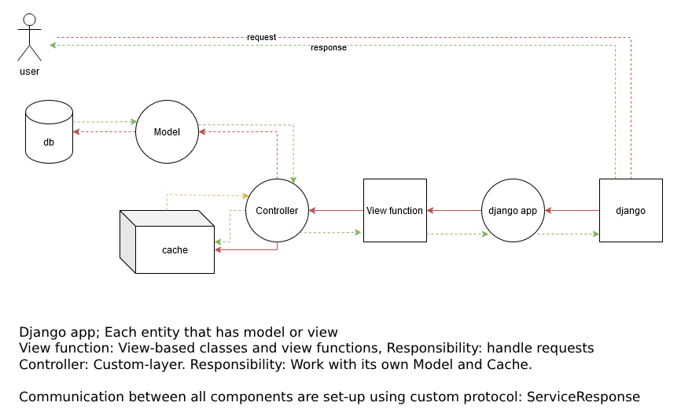
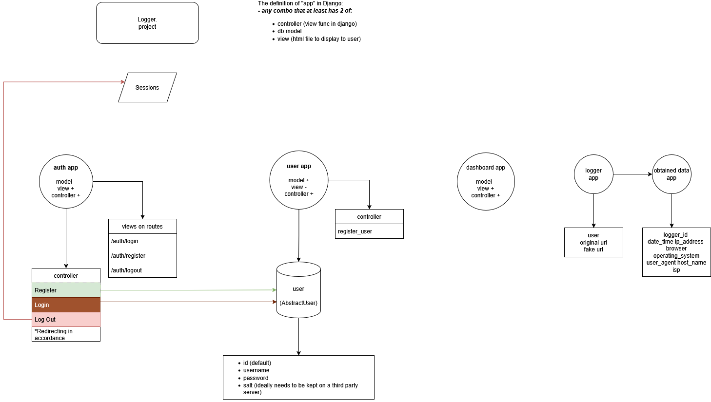

# Project Architecture

## CRUD Operations in Models

All CRUD methods are now moved to Models:

- **create** (all params needed) → Creates one based on params.
- **index** (may have params) → Shows all based on params.
- **show** (has at least one param) → Shows one based on params.
- **update** (at least `id`, `new_content`) → Updates one based on params.
- **destroy** (at least `id`) → Deletes one based on params.

Additional method:

- **clone** (at least `id`) → Clones the object into a new one with a different ID.

## Logger Django App

### App Diagram
Below is the architecture of the Logger Django app:

Each entity that has a model or view follows this structure:

- **View function:** Handles requests using view-based classes and functions.
- **Controller:** A custom layer that interacts with its own Model and Cache.
- **Model:** Manages database interactions.
- **Cache:** Used to optimize performance.

All communication between components follows a custom **ServiceResponse** protocol.

## Principle

- The project follows the **LOB** principle combined with **YAGNI**.
- Violates PEP line length for one-liners.
- It may challenge over-engineered development approaches.

## Segregation

### View: (Presentation Layer)

- Views are class-based and handle REST methods: `get`, `post`, `put`, `patch`, `delete`.
- Each view manages only one path.
- Ideally, views should not contain business logic. They return `Controller.call` or files (HTML).
- Some cases may require avoiding additional layers such as `Transaction`, `Contract`, or `BusinessLogic`.
- Paths with subpaths should have separate View classes (e.g., `/path` → `PathView`, `/path/data/<id>` → `DataView`).
- Views pass data to templates.
- `dispatch` may be used to handle `get` requests.

### Controller: (Business Logic Layer)

- Controllers are custom classes with limited CRUD methods: `index`, `show`, `update`, `destroy`.
- They provide an interface for working exclusively with their own models.
- Responses are structured using a custom `ServiceResponse` data structure.

### Full Flow

1. View receives data and passes it to the Controller.
2. Controller processes the request and returns a `ServiceResponse`.
3. View renders or redirects based on the `ServiceResponse` status.

### Entities, Models and Relations

> Note: The following image may be outdated.

